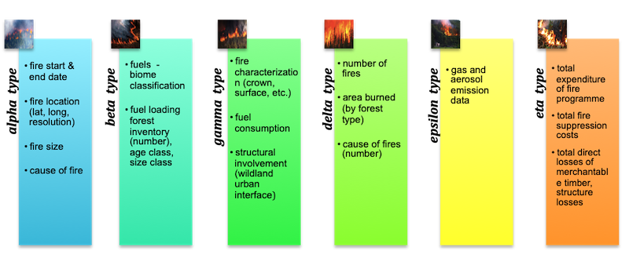

*Forest fire assessment types - phenological or physiological*

Forest fires are grouped into following main categories on the basis of fuel ignition, flame development and fire spreading behaviour:

Subsurface or Ground Fire: A fire that burns with in the ground/surface fuel layers at a very slow rate. Fuel includes peat, partly decayed leaves, tree needles etc. Factor supporting this type of fire are - limited oxygen supply and no wind / calm atmosphere. This kind of fire is rare, and move in centimetres or maximum a few meters per day but can last long and can spread onto large territories (Földi and Kuti, 2016).

Surface Fire: A fire burning on and above the forest floor and below tree crown. Fuel for surface fire includes dead fallen leaves, grass, litter, biomass, ground debris, grasses, vegetation, windfalls, bush, slash, young smaller trees and lower branches of standing timber, etc at or near the surface. Rate of fire spread depends on the slope of the terrain, climate, fuel density, tree size and continuity(Kim et al., 2016; Yang, 2018). Heavy wind speeds can spread fire as much as ~500 m/hr.

Crown Fire: A fire that burns the upper foliage saplings, trunks and shrouds and the crowns of standing timber in conjunction with surface fires. Wind is the major driving factor to expand the crown fire. Crown fires can be classified according to the degree of dependence on the surface fire phase:

(i) Intermittent/Passive crown fire: A fire in which trees’ crown discontinuously burns, but rate of spread is controlled by the surface fire phase.
(ii) Dependent/active crown fire: A fire that advances with a well-defined wall of flame extending from the ground surface to above the crown fuel layer. Probably most crown fires are of this class. Development of an active crown fire requires a substantial surface fire, and thereafter the surface and crown phases spread as a linked unit.
(iii) Running/ independent crown fire: A fire that advances in the crown fuel layer only. 

## Major drivers of forest fire

The forest fires triangle corners and centre represent topography, climate, fuel and people factors respectively. Different combination of these factors influences the forest fires behaviour and spread. Characterization of forest fires by their patterns of fire ignition type, seasonality intensity, frequency with which they occur, severity and their spatial pattern or extent is known as fire regime.

Fire regimes vary with topography, vegetation and climate zone. Topography elements include – slope, elevation, aspect (direction of slope w.r.t solar radiation) regulates forest fires behaviour via affecting fuel moisture level and local climate. Due to undulated slopes, rough topography and rare water sources forest fires prevention measures are difficult in mountains. 

Based on the fires affected areas, forest fires size can be categories as: small (< 1 Ha), average (1 - 50 Ha) and large (> 50 Ha) forest fires (Földi and Kuti, 2016).

## Use of remote sensing technology to monitor incidences of Forest Fire.

Information requirement for forest fire assessment types can be achieved using Remote Sensing data diplayed in image (Source & modified from: FAO, 2006 and WMO, 2004)

Remote sensing satellite sensors are valuable tool for mapping and to monitor fire events by detecting heat, smoke and damaged land. Specifically, thermal infrared (TIR) sensors provides data to monitor fire incidences. Satellite data are also being used for risk assessment to help prevent fires breaking out in the first place.

For best example some active remote sensing satellites are available as open source databases such as; Moderate Resolution Imaging Spectrometer (MODIS) is a sensor on board NASA: TERRA and AQUA satellites. MODIS version 4 contextual algorithm (Giglio et al. 2003) has been used for monitoring active forest fire.  The Visible Infrared Imaging Radiometer Suite (VIIRS) sensor was launched aboard the Suomi National Polar-orbiting Partnership (NPP) satellite on 28th October, 2011 and on 11th January, 2012.

Multispectral remote sensing data is useful to interpret burnt scar/area visually and digitally by the standard false color composite (FCC band combination) NIR+Red+Green. More visual and digital interpretation of the severe or moderate burnt area such as, active flame, smoke plume, direction of fire etc. can be easily mapped by shortwave infrared composite SWIR+NIR+Red using Resourcesat-2, AWiFS, an Indian remote sensing satellite dataset (Reddy et al. 2017). 

Other satellite sensors also have coverage capability- IRS 1D/P6, NOAA 17, NOAA 18 for daytime coverage pass and DMSP-OLS for nighttime coverage pass. Forest fire damage assessment has been also done using Radarsat-1 SAR, but the data cost are very high and limited. 

## Organisation on Disaster

Sentinel Asia is a voluntary initiative of Asia-Pacific Regional Space Agency Forum (APRSAF) for collaboration amongst space and disaster management agencies under the APRSAF initiative. It supports disaster management efforts in the Asia-Pacific region through the provision of and imagery derived from earth observation satellites. Wildfire monitoring working group of this initiative supports to cater to SENDAI framework of Disaster Risk Management with efforts like fire and danger warning, early fire detection, forecasting fire expansion, early fire control, suppression and restoration of damaged forest.

Soil with ample moisture content compare to dry soil of burnt area with charcoal contents shows different spectral characteristics in SWIR and NIR bands (Pleniou and Koutsias, 2013). Burn severity classification based on vegetation, surface fuels and soil category has been set by spectral mixture analysis using Landsat TM and MSS data to delineate burn area into the classes such as, UV-Unburned Vegetation (green or NPV), BS-Bare Soil (no char), MBPLV-Mixed Burned Pixels with LOW Vegetation (sparse shrubs/open canopy trees), MBPHV-Mixed Burned Pixels with HIGH Vegetation (closed/dense canopy trees) and SB-Severe Burn (SB consists char/ash content) (Rogan and Franklin, 2001).

## Fire Indices

Normalized Burned Ratio (NBR) and NDVI (Normalized Difference Vegetation Index) are two mainly key burn severity channels to estimate the pre and post fire fractions of the active or recent burnt areas, affected vegetation, bare land, char, healthy vegetation etc. (Hudak et al. 2007, Smith et al. 2007). NBR can estimate the percentage of burnt area and NDVI can estimate the percentage of vegetation in burnt affected areas because SWIR range can render quite high variance in heavily burned pixels and in case of NIR range it’s vice versa (Pleniou and Koutsias, 2013). On the basis of moisture and chlorophyll content, spectral response of charcoal from burnt surfaces has been studied comparatively with green vegetation, dry and non-photosynthetic vegetation (NPV) and soil using post-fire satellite data of hyperspectral (2003), Quickbird (2007) and Landsat 8 (2013) (S. A. Lewis et al. 2017).

High burn severity areas usually reflect low albedo due to high char abundance but moderate burn severity shows high albedo due to bright soil and rocks. This approach is more helpful to differ between the burnt area and soil/rock for accuracy mapping of forest fire assessment.Global forest fire danger indices based on weather parameters are available but need regional indices for basic and better assessment (Pyne et al. 1996, Bhandari et al. 2012, Smith et al. 2007).

In case of western Himalaya region forest fire season usually happens in between the months of march and june and mostly occur in dry, high temperature and moisture-less coniferous chir pine forests (1000-1800 m). Several parameters have been used for the modeling of fire risk zones are: fire occurrence maps, classified vegetation map, road network for proximity analysis, maximum temperature data, relative humidity and rainfall data, hydrology (rivers, streams and waterbody) map, settlement location map for proximity analysis, forest block division maps etc.

## Reference

 Baijnath- Rodino, J.A., Foufoula - Georgiou, E., Banerjee, T. (2020) Reviewing the "Hottest" Fire Indices Worldwide. Earth and Space Science Open Archive (ESSOAr) | https://doi.org/10.1002/essoar.10503854.1, CC_BY_4.0. Available from: https://www.researchgate.net/publication/343376346_Reviewing_the_Hottest_Fire_Indices_Worldwide [accessed Nov 15 2021].
Cordeiro R.C., Turcq B., Ribeiro M.G., Lacerda L.D., Capitaneo J., Oliveira da Silva A ., Sifeddine A ., Turcq P .M . (2002) Forest fire indicators and mercury deposition in an intense land use change region in the Brazilian Amazon (Alta Floresta, MT) The Science of the Total Environment 293(2002)247–256.
F.A.O. (Food and Agriculture Organization of the United Nations) (YEAR) International Handbook on Forest Fire Protection, Technical guide for the countries of the Mediterranean basin.
Földi, L., Kuti, R., 2016. Characteristics of Forest Fires and their Impact on the Environment. Aarms 15, 5–17.
Gahlod N. S. S., Jaryal N., Roodagi M., Dhale S. A., Kumar D. and Kulkarni R. (2019) Soil Organic Carbon Stocks Assessment in Uttarakhand State using Remote Sensing and GIS Technique. Int.J.Curr.Microbiol.App.Sci (2019) 8(1): 1646-1658.
Hudak A. T., Morgan P., Bobbitt M. J., Smith A.M.S., Lewis S. A., Lentile L. B., Robichaud P. R., Clark J. T. and McKinley R. A. (2007) The relationship of multispectral satellite imagery to immediate fire effects. Fire Ecology Special Issue, Vol. 3, No. 1, 2007.
Hislop S., Jones S., Soto-Berelov M., Skidmore A, Haywood A. & Nguyen T. H. (2019) High fire disturbance in forests leads to longer recovery, but varies by forest type. doi: 10.1002/rse2.113.
Joshi P. P., Singh S. K., Rathore B. P., Bahuguna I. M. and Kumar R. (2018) Effect of Forest Fire on Snow Reflectance in Uttarakhand Region: An Analysis Using AWiFS and INSAT-3D Data. Journal of the Indian Society of Remote Sensing (December 2018) 46(12):2107–2111. DOI: 10.1007/s12524-018-0872-1.
Jain T. B., Gould W. A., Graham R. T., Pilliod D. S., Lentile L. B. and Gonzalez G. (2008) A Soil Burn Severity Index for Understanding Soil-Fire Relations in Tropical Forests. Ambio, Vol. 37, No. 7/8, Fire Ecology and Management, pp. 563-568.
Johnstone J. F. and Kasischke E. S. (2005) Stand-level effects of soil burn severity on postfire regeneration in a recently burned black spruce forest. Can. J. For. Res. 35: 2151–2163, doi: 10.1139/X05-087.
Kim, D.W., Chung, W., Lee, B., 2016. Exploring tree crown spacing and slope interaction effects on fire behavior with a physics-based fire model. Forest Sci. Technol. 12, 167–175. https://doi.org/10.1080/21580103.2016.1144541
Lewis S. A., Hudak A.T., Robichaud P.A., Morgan P., Satterberg K.L., Strand E.K., Smith A.M.S., Zamudio J.A. and Lentile L.B. (2017) Indicators of burn severity at extended temporal scales: a decade of ecosystem response in mixed-conifer forests of western Montana. International Journal of Wildland Fire, 26, 755–771 doi: 10.1071/WF17019.
Malik T., Rabbani G. and Farooq M. (2013) Forest Fire Risk Zonation Using Remote Sensing and GIS Technology in Kansrao Forest Range of Rajaji National Park, Uttarakhand, India. International Journal of Advanced Remote Sensing and GIS 2013, Volume 2, Issue 1, pp. 86-95, Article ID Tech-56. ISSN 2320 – 0243.
Mahapatra S. K., Reddy G. P. Obi, Nagdev R., Yadav R. P., Singh S. K. and Sharda V. N. (2018) Assessment of soil erosion in the fragile Himalayan ecosystem of Uttarakhand, India using USLE and GIS for sustainable productivity. Current Science, Vol. 115, No. 1.
Pleniou M. and Koutsias N. (2013) Sensitivity of spectral reflectance values to different burn and vegetation ratios: A multi-scale approach applied in a fire affected area. ISPRS Journal of Photogrammetry and Remote Sensing, Volume 79, May 2013, Pages 199-210.
Quintano C., Fernández-Manso A., Stein A. and Bijker  W. (2011) Estimation of area burned by forest fires in Mediterranean countries: A remote sensing data mining perspective. Forest Ecology and Management 262 (2011) 1597–1607.
Roy P.S. (2003) Forest Fire and Degradation Assessment using Satellite Remote Sensing and GIS. Proceedings of the Training Workshop, Satellite Remote Sensing and GIS Applications in Agricultural Meteorology, by UNISDR, WMO, IMD, CSSTEAP, IIRS, NRSA, SAC.
Rogan J. and Franklin J. (2001) Mapping Wildfire Burn Severity in Southern California Forests and Shrublands Using Enhanced Thematic Mapper Imagery. Geocarto International, Vol. 16, No. 4, December 2001.
Sahana M. and Ganaie T.A. (2017) GIS-based landscape vulnerability assessment to forest fire susceptibility of Rudraprayag district, Uttarakhand, India. Environ Earth Sci (2017) 76:676. DOI 10.1007/s12665-017-7008-8.
Shukla B.P. and Pal P.K. (2008) Automatic smoke detection using satellite imagery: preparatory to smoke detection from Insat‐3D. International Journal of Remote Sensing Vol. 30, No. 1, 10 January 2009, 9–22.
Sobrino J.A., Llorens R., Fernández C., Fernández-Alonso J.M. and Vega J.A. (2019) Relationship between Soil Severity in Forest Fires Measured In Situ and through Spectral Indices of Remote Detection. Forests 2019, 10, 457; doi:10.3390/f10050457.
Sheil D. (1999) Tropical forest diversity, environmental change and species augmentation: After the intermediate disturbance hypothesis. Journal of Vegetation Science 10: 851-860, 1999.
Smith A.M.S., Lentile L.B., Hudak A.T. and Morgan P. (2007) Evaluation of linear spectral unmixing and ∆NBR for predicting post‐fire recovery in a North American ponderosa pine forest. International Journal of Remote Sensing, Vol. 28, No. 22, 20 November 2007, 5159–5166.
Vadrevu K.P., Badarinath K.V.S. and Anuradha E. (2008) Spatial patterns in vegetation fires in the Indian region. Environ Monit Assess (2008) 147:1–13. DOI 10.1007/s10661-007-0092-6.
White J.D., Ryan K.C., Key C.C. and Running S.W. (1996) Remote Sensing of Forest Fire Severity and Vegetation Recovery. Int. J. Wildland Fire 6(3): 125-136,1996 O IAWF. Printed in USA.
Zheng Z., Zeng Y., Li S. and Huang W. (2016) A new burn severity index based on land surface temperature and enhanced vegetation index. International Journal of Applied Earth Observation and Geoinformation, Volume 45, Part A, March 2016, Pages 84-94.
Yang, J.C., 2018. Dimensional analysis on forest fuel bed fire spread. Can. J. For. Res. 48, 105–110. https://doi.org/10.1139/cjfr-2017-0049
