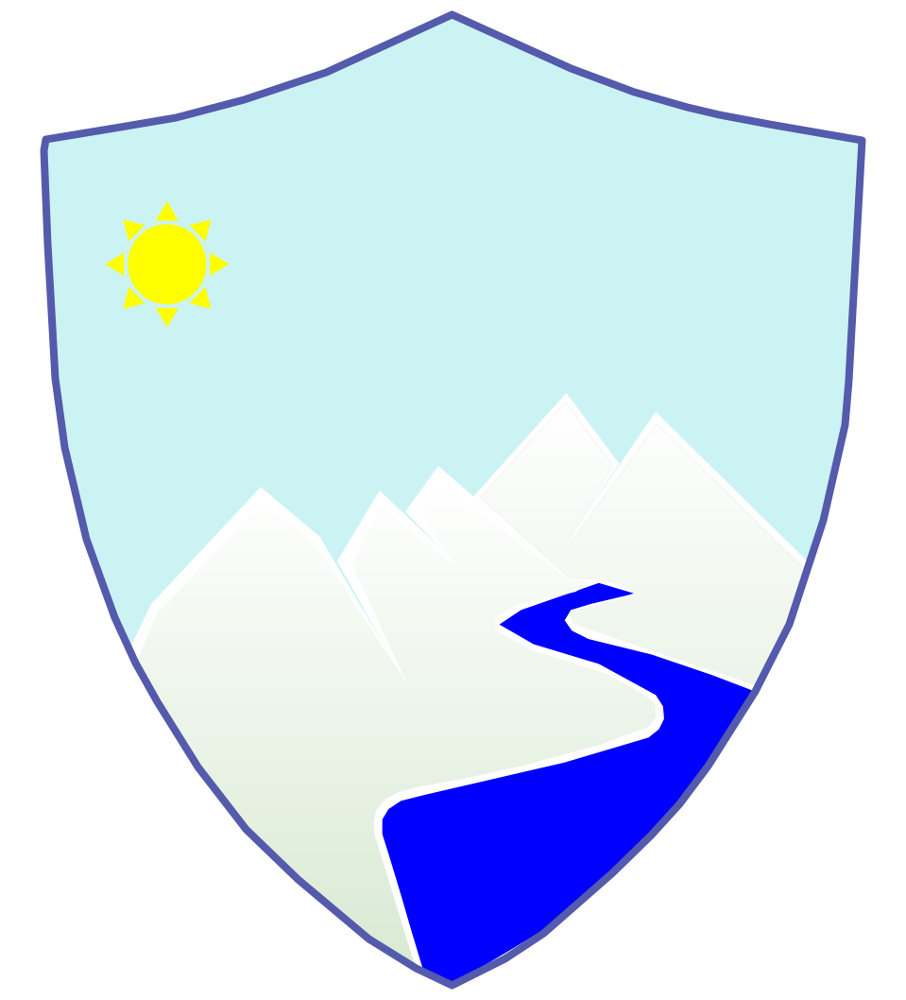

Today on the ocassion of World Nature Conservation Day I would like write about the best holistic approach of Nature based solutions (NbS). We should think why we need to observe these environmental calender days that the United Nations (UN) and other dedicated organisations celebrates respective themes towards the conservation of environment. 2022-2030 have been marked as the Ecological Restoration Deade of the UN, while various initiatives on ecosystem approach to conserve biodiversity been considered for Disaster Risk Reduction (DRR) by Sendai Framework.

NbS have been adopted in decision making to reboot human's realtionship with nature. According to Global Risk Survey by the World Economic Forum; in coming 10 years loss of biological diversity and ecosystem degradation are top five risks. Pandemic in last two years is great lesson to the world the way we treating and consuming resources.

The younger generation need to adapt NbS and need to promote simple living and sustainable lifestyle so that earth can sustain lifelong for future generation's wellbeing. At the same time on 28 July, 2022, Earth Overshoot Day have been observed worldwide as on this estimated date we humans have consumed more natural resources than earth can produce in whole year of 2022. We are literally living on credit 'ecological debt' untill end of this year and that's a sad news. Earth can't produce natural resources faster than the consuming rate by humans. Declining rate of resources like forest due to deforestation, fishing due to overfishing, food due to wastage of food and intense farming and at last clean Air due to carbon emissions are already used up for this year.

There is need to holistic approach to maintain balance of ecosyatem services tool on economic recovery of world.
