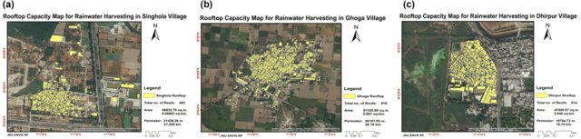
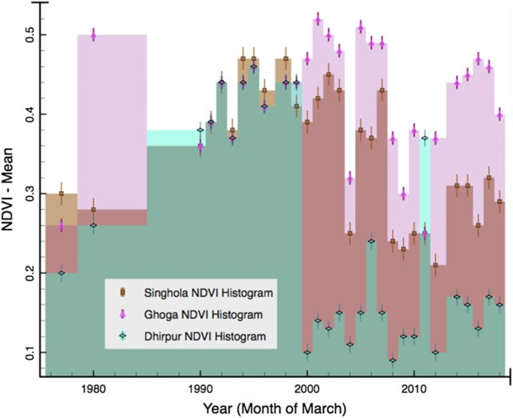
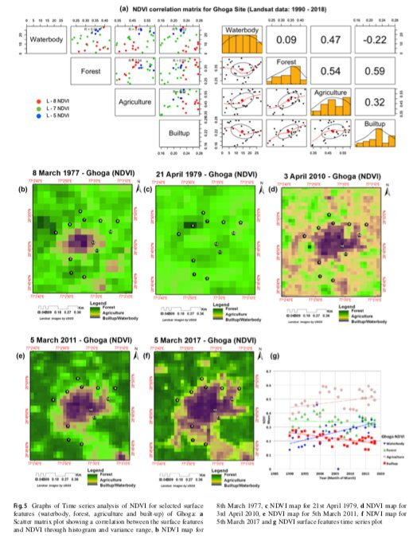
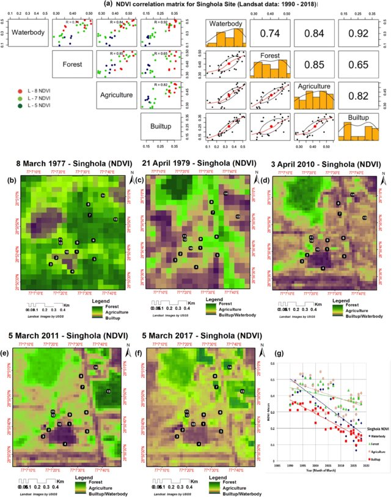
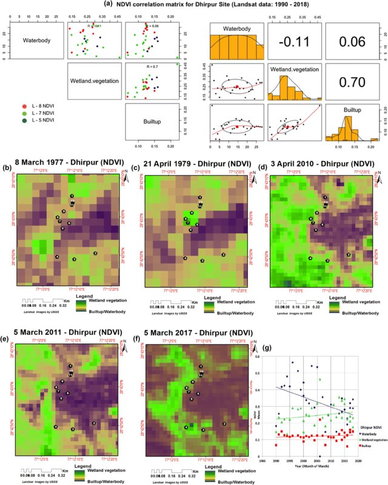

  

This review work was done To study Forest fire causing the loss of carbon sequestered in forest biomass due to climate change with the help of fire counts from MODIS and VIIRS satellite data were analyzed (2002-2019) during the peak fire season (April-June months). Under the guidance of <a href="https://www.jnu.ac.in/Faculty/smukherjee/">Prof. Usha Mina</a> that helped to understand the quantification of forest biomass carbon stock eqvivalent to sum of the carbon pools on the forest floor (aboveground biomass + deadwood + litter considered for analysis). Also surface fuel content per unit area (ton/ha) collected from secondary data for different predominant forest types like sal, mixed and moist forest. Then surface fuel load in forest and total burnt forest area were further helpful to calculate the approximate carbon loss in forest biomass. For analysis of climate attributes, India Meteorology Data (IMD) weather station data were provided by Prof. A.P. Dimri and were analyzed and correlated to the fire counts each year. Some fire risk indices were generated using climate data to find out the estimated range for favorable/non-favorable conditions to forest fire that indicated the loss of forest biomass carbon stocks due to deposited biomass on the forest floor.

Relative infiltration capacity (high, moderate and low potential area) map generated in ArcGIS software to visualize percolation of groundwater recharge on the final layout. Rooftop capacity mapping using Google Street portal for the rainwater storage capacity and calculated in ArcGIS software to fulfill one of the objectives of groundwater conservation work.

Time-series Normalized Difference Vegetation Index (NDVI): (from 1977 to 2017) decadal frames generated using Landsat satellite data for vegetation health analysis in corporation with soil health for the selected villages. NDVI timeframes were useful for understanding the health indicator of soil. 

Softwares used:  ArcGIS, Erdas Imagine, Google earth engine (GEE), R studio, Gradistat v.4.0, Surfer Golden v.16.0.

For more details you can read full article published at the [Environmental Earth Sciences, volume 78, Article number: 329 (2019)](https://link.springer.com/article/10.1007/s12665-019-8332-y).

Awareness campaign on water conservation, rainwater harvesting model, environmental and health issues in theses villages and schools were actively organised with students.

