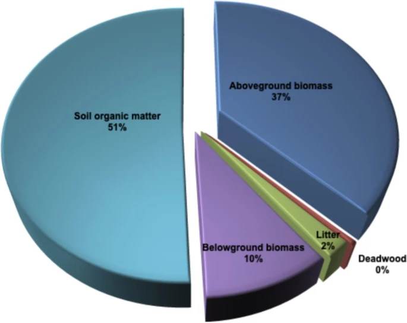
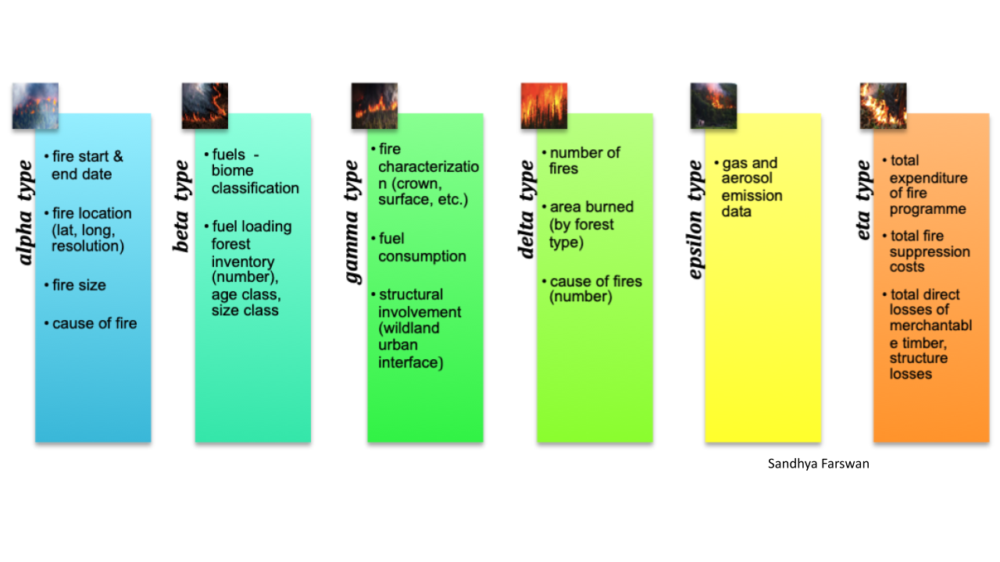
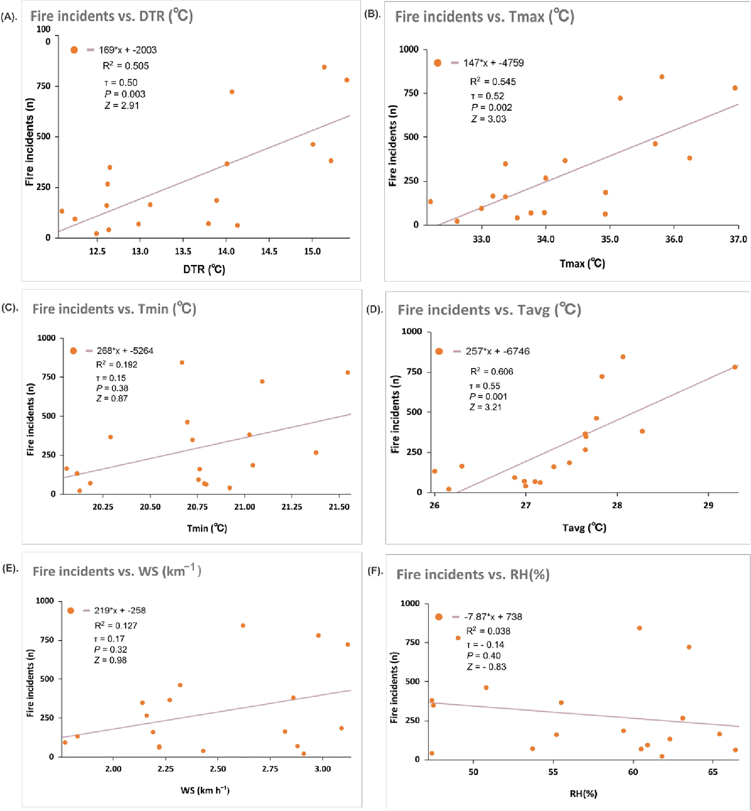
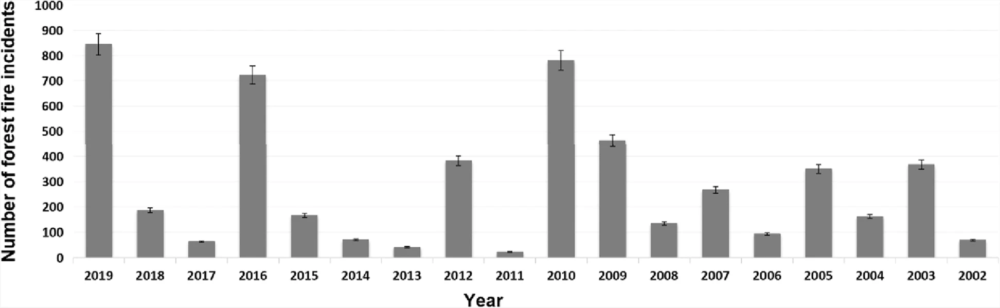

  

This review work was done To study Forest fire causing the loss of carbon sequestered in forest biomass due to climate change with the help of fire counts from MODIS and VIIRS satellite data were analyzed (2002-2019) during the peak fire season (April-June months). Under the guidance of <a href="https://www.jnu.ac.in/content/ushamina">Prof. Usha Mina</a> that helped to understand the quantification of forest biomass carbon stock eqvivalent to sum of the carbon pools on the forest floor (aboveground biomass + deadwood + litter considered for analysis). Also surface fuel content per unit area (ton/ha) collected from secondary data for different predominant forest types like sal, mixed and moist forest. Then surface fuel load in forest and total burnt forest area were further helpful to calculate the approximate carbon loss in forest biomass. 

Our results also indicated that, in the future, carbon stock loss may increase, with an increase in the percentage of the burned area as well as with the frequency of forest fires. To minimize loss, the interlinkages between forest fire incidents, fuel type and its availability, and climatology need to be explored. In Himalayan forest, carbon is predominately stored in soil organic matter and aboveground biomass, with smaller amounts found in belowground biomass, litter, and deadwood. 

The sum of the carbon pools on the forest floor is equivalent to forest biomass carbon stock. Based on this, an assumption was made that surface forest fires mostly consume a portion of aboveground biomass (AGB), which consists of dry leaves, twigs, dry litter, and dry herbaceous grasses. Hence, AGB represents the forest floor carbon pool that is vulnerable to fire; however, the total forest carbon stock that is vulnerable to fire includes AGB, deadwood, and litter. Aboveground biomass stored in branches and boles is not usually consumed during surface fires.

Loss of forest biomass carbon stock in forest fire incidents during the fire season was calculated by multiplying the average forest floor fuel load by forest burned area per year. For analysis of climate attributes, India Meteorology Data (IMD) weather station data were provided by Prof. A.P. Dimri and were analyzed and correlated to the fire counts each year. Some fire risk indices were generated using climate data to find out the estimated range for favorable/non-favorable conditions to forest fire that indicated the loss of forest biomass carbon stocks due to deposited biomass on the forest floor.

This novel approach or study shows that forest fires are causing a loss of carbon sequestered in forest biomass carbon stock. In the absence of forest fire, the lost forest biomass carbon would have been incorporated into the soil via carbon cycling processes to be made available to plants to support forest productivity. Forest-fire-induced loss of forest biomass carbon stock is high, depriving the soil of nutrients. 

For more details you can read full article published at the [Fire Ecology, 19, Article number: 14 (2023)](https://fireecology.springeropen.com/articles/10.1186/s42408-023-00177-4).
