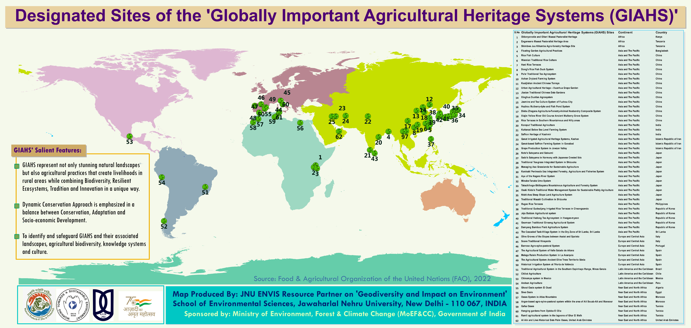

World Heritage Day is observed as International Day For Monuments and Sites on 18 July every year and the significance of this initiative is protection of the World Cultural and Natural Heritage.

The Globally Important Agricultural Heritage Systems (GIAHS) Map

So I collected data on The Globally Important Agricultural Heritage Systems (GIAHS) from the Food and Agriculture Oraganization of the United Nations (FAO) and generated map using ArcGIS. Agriculture is most old & traditional support system to human, also very sensitive indicator to climate and environment. Globally 62 GIAHS sites are designated by FAO all around the world to protect food security, unique natural agriculture practices, ethnicity, traditional ecological knowledge and livelihoods. In India 3 GIAHS sites are in Koraput Traditional Agriculture (Odisha), Kuttanad Below Sea Level Farming System (Kerala) and Pampore Saffron Heritage (Jammu & Kashmir).

The Geological Heritage Sites of India Map

In India total 34 National Geological Monuments are designated as geological heritage by Geological Survey of India (GSI). In India theme of the year for National Tourism Day was 'Dekho Apna Desh' to promote rich culture through heritage and diversity with education, history and interesting geological significance to environment & earth science. This map has detailed category wise heritage as Fossil park, Stromatolite park, Geological marvels, Rock monuments, EcoGeo monuments and Stratigraphy monuments.

The Geo-Tourism Sites in North-Eastern States of India Map

12 Geo-Tourism sites have been notified by Geological Survey of India (GSI) in North-East India to promote tourism campaign on uncover India and sharing knowledge on natural heritage. Most of theses heritage sites comes under UNESCO world heritage category.
