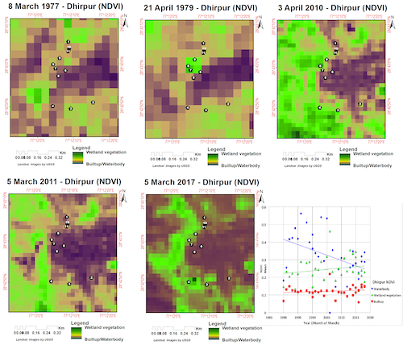
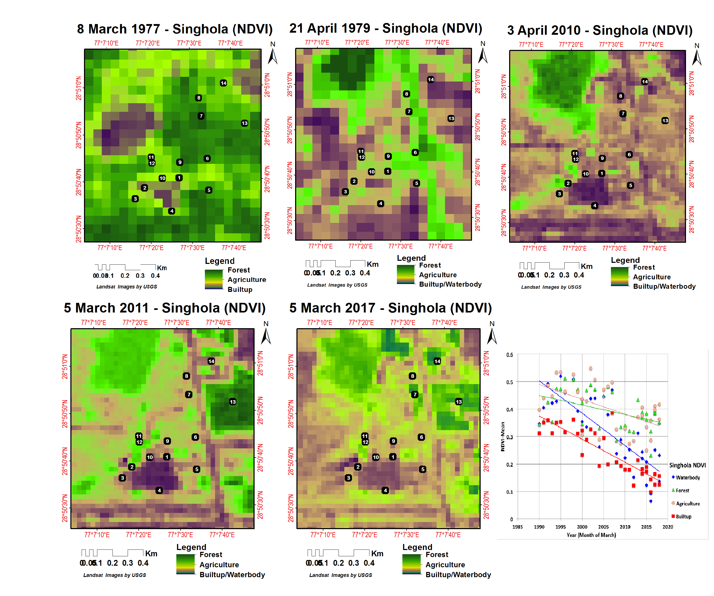
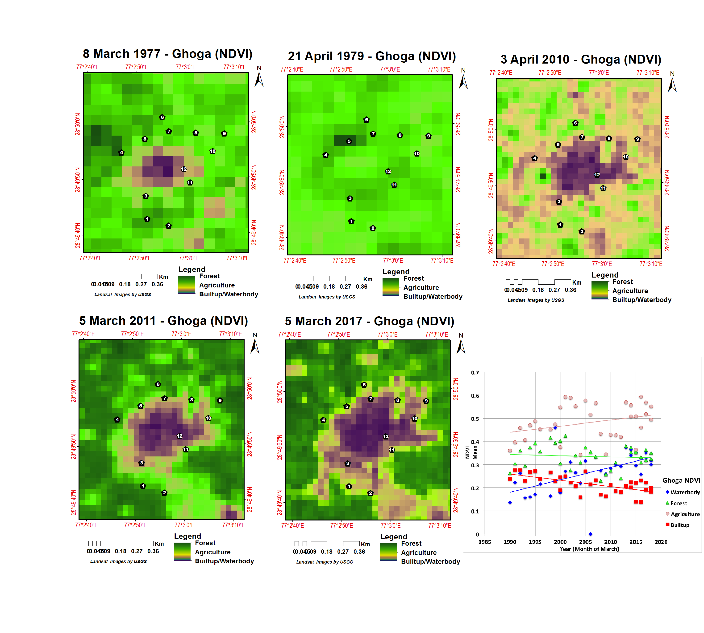
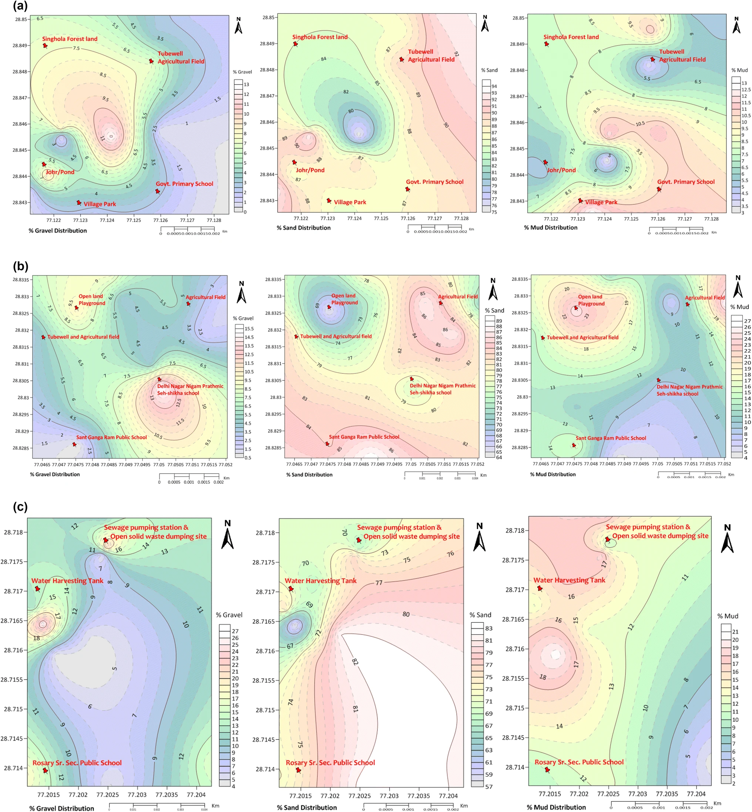
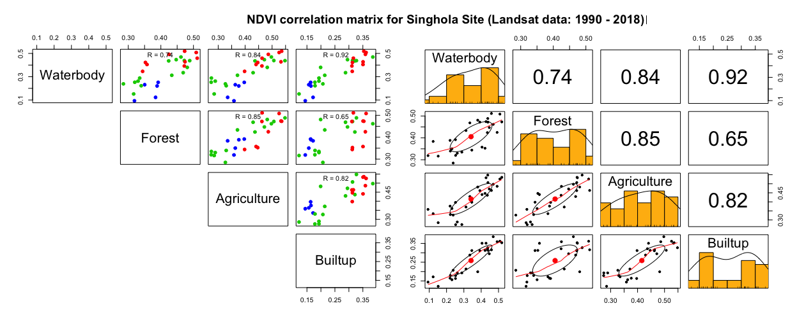
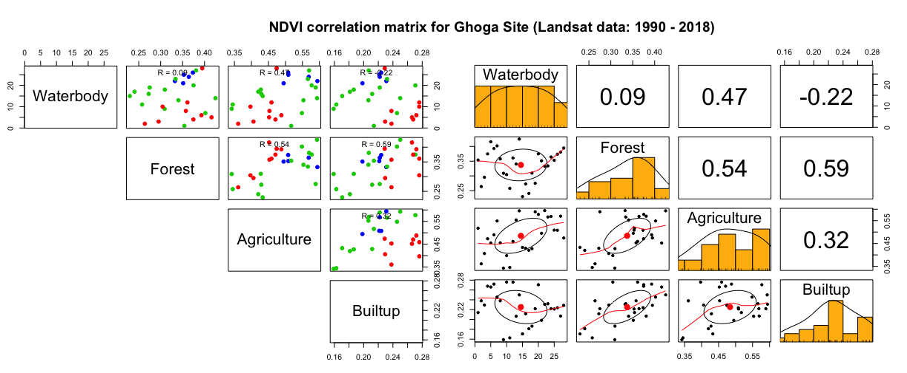
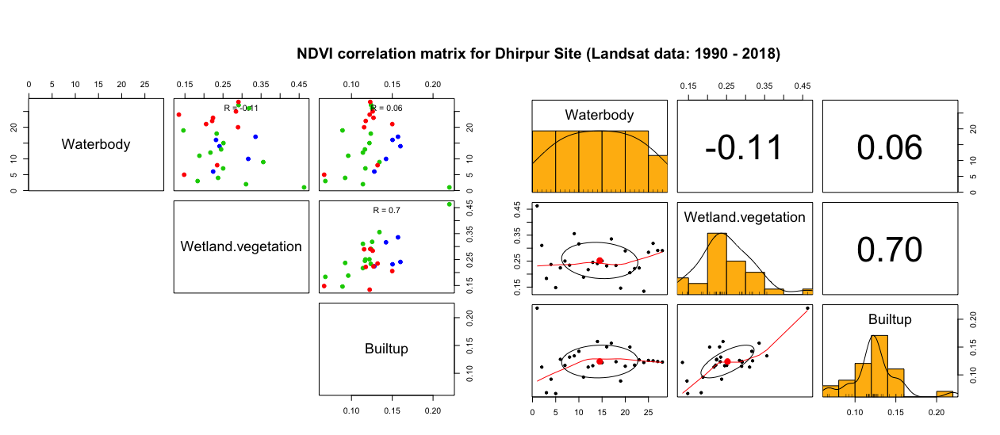
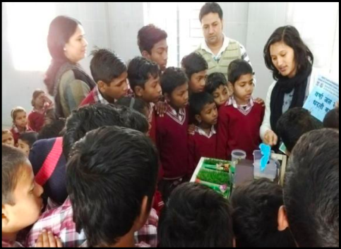
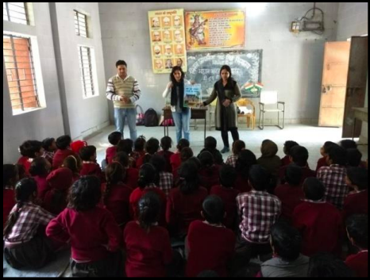

  

This work was done for a pilot project Community-driven Environmentally Sustainable Village Programme (CESVP) - Soil samples were collected from different landform/surface feature/types and analyzed through geo-technical methods; followed by oven-dry and sieve-fraction method for the textural analysis. That helped to understand the feasibility of soil infiltration capability for rainfall runoff and water balance calculation to recharge underground aquifer/groundwater on the basis of the percentage fraction of sand in each sample. Outcome values of soil grain sizes were further analyzed through the statistical software GRADISTAT in which brief outcome of Soil Textural Analysis as Sand:Mud ratio and Silt:Clay ratio helped to get final result. Relative infiltration capacity (high, moderate and low potential area) map generated in ArcGIS software to visualize percolation of groundwater recharge on the final layout. Rooftop capacity mapping using Google Street portal for the rainwater storage capacity and calculated in ArcGIS software to fulfill one of the objectives of groundwater conservation work.

Time-series Normalized Difference Vegetation Index (NDVI): (from 1977 to 2017) decadal frames generated using Landsat satellite data for vegetation health analysis in corporation with soil health for the selected villages. NDVI timeframes were useful for understanding the health indicator of soil. 

Softwares used:  ArcGIS, Erdas Imagine, Google earth engine (GEE), R studio, Gradistat v.4.0, Surfer Golden v.16.0.

For more details you can read full article published at the [Environmental Earth Sciences volume 78, Article number: 329 (2019)](https://link.springer.com/article/10.1007/s12665-019-8332-y).

Awareness campaign on water conservation, rainwater harvesting model, environmental and health issues in theses villages and schools were actively organised with students.

